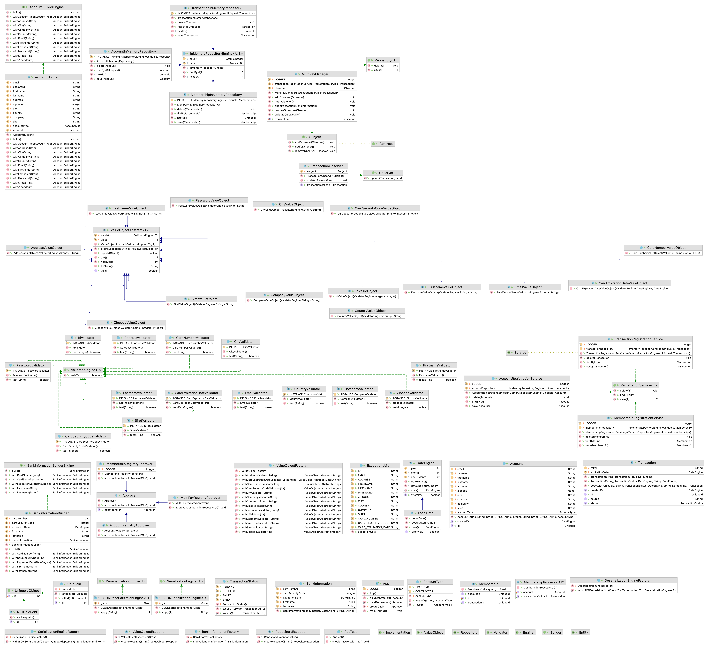

# ESGI AL2 - Florian Gustin - CC1

Created: November 21, 2021 10:50 PM

# Diagramme de classes :

# Pré-requis :

- Java 11
- Maven

# Argumentation :

J'ai choisi de séparer l'application en 3 grands modules :

- core
- multipay
- marketplace

J'ai essayé d'avoir une base de DDD pour cet exercice.

Pour enchainer simplement les étapes du processus d'adhésion j'ai choisis d'utiliser le pattern de la chaine de responsabilité qui me permet d'ordonner par le biais d'handlers (approvers). Le handler va effectuer son traitement sous certaines conditions. Dans le cas contraire le programme s'arrête à l'étape non procédée.

Pour la communication entre les modules multipay et marketplace j'ai pris l'initiative d'implémenter un pattern observer comme solution stub avec un seul observer dans le cas d'un paiement ou d'une autorisation de paiement et pour des raisons de sécurité, un seul observer doit écouter les changements.

J'avais commencé à un implémenter un marshaller, mais au final je n'ai pas trouvé utile dans le cadre de l'exercice de continuer puisqu'il n'y a pas réellement de communications sortantes HTTP.

J'ai pour habitude d'utiliser des values objects et des validators, j'ai donc fait la même chose dans le cadre de l'exercice. Ils me permettent de vérifier l'exactitude des données et d'éventuelles modifications malveillantes. En général ils servent principalement à refléter à l'utilisateur la non conformité des champs.

J'ai aussi intégrer plusieurs génériques afin de gagner du temps. L'utilisation des factory et builder sont presque obligatoires à mon sens afin de masquer et fluidifier les créations d'objets.

Pour ce qui est des tests unitaires. Par manque de temps je ne les ai pas implémenté dans leur totalité.